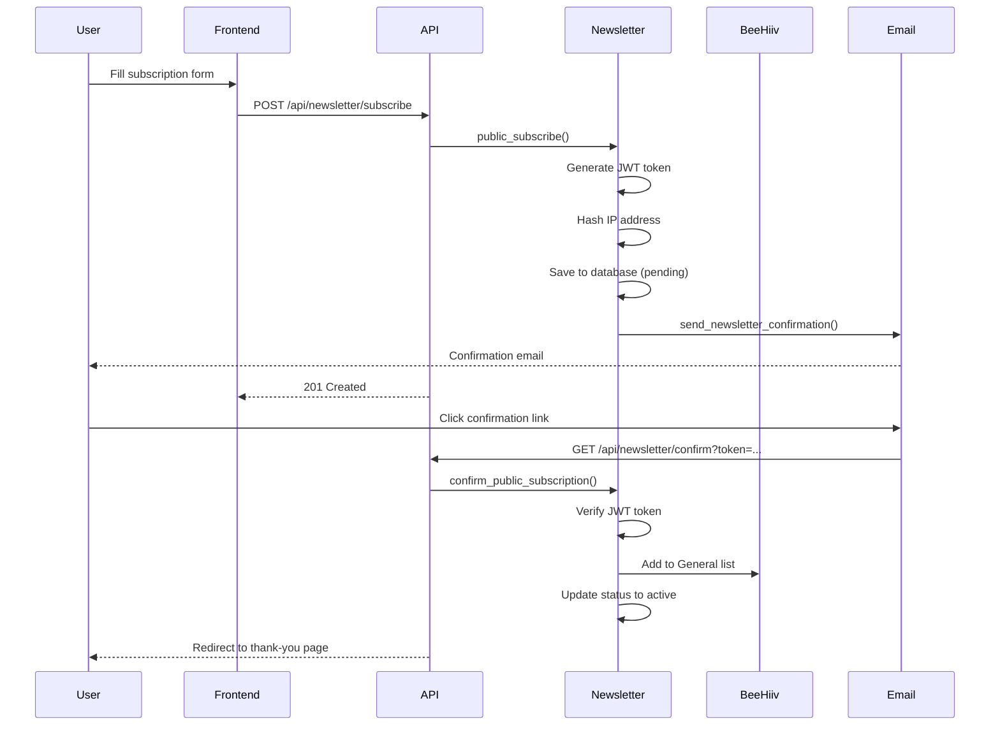

# Newsletter Subscription Integration (US-058)

## Overview

The newsletter subscription system implements a double opt-in workflow with BeeHiiv integration for managing email subscribers. This system is separate from the member auto-subscription system and is designed for public newsletter sign-ups.

**User Story:** As a user, I want to subscribe to the newsletter so that I can receive updates.

**Implementation Date:** 2025-01-10

---

## Architecture

### Components

1. **NewsletterService** (`/backend/services/newsletter_service.py`)
   - Manages public newsletter subscriptions
   - Implements double opt-in flow
   - Handles GDPR compliance
   - Integrates with BeeHiiv API

2. **BeeHiivService** (`/backend/services/beehiiv_service.py`)
   - Provides BeeHiiv API integration
   - Manages newsletter lists
   - Handles subscriber operations

3. **EmailService** (`/backend/services/email_service.py`)
   - Sends confirmation emails
   - HTML email templates
   - Postmark integration

4. **Newsletter Routes** (`/backend/routes/newsletter.py`)
   - Public API endpoints
   - Request validation
   - Rate limiting

5. **Newsletter Schema** (`/backend/models/schemas.py`)
   - NewsletterSubscription model
   - Status enums
   - Source tracking

---

## API Endpoints

### POST /api/newsletter/subscribe

Create new newsletter subscription with double opt-in.

**Request:**
```json
{
  "email": "user@example.com",
  "name": "John Doe",
  "interests": ["events", "training", "articles"],
  "consent": true
}
```

**Response (201 Created):**
```json
{
  "message": "Please check your email to confirm your subscription",
  "status": "pending",
  "email": "user@example.com",
  "subscription_id": "550e8400-e29b-41d4-a716-446655440000"
}
```

**Rate Limit:** 5 requests/hour per IP

**Errors:**
- `400 Bad Request` - Invalid email or missing consent
- `409 Conflict` - Email already subscribed
- `429 Too Many Requests` - Rate limit exceeded

---

### GET /api/newsletter/confirm?token={token}

Confirm newsletter subscription using JWT token from email.

**Parameters:**
- `token` (query string) - JWT confirmation token

**Response:**
- `303 See Other` - Redirects to thank you page on success
- `303 See Other` - Redirects to error page on failure

**Rate Limit:** 10 requests/hour

---

### POST /api/newsletter/unsubscribe

Unsubscribe from newsletter.

**Request:**
```json
{
  "email": "user@example.com",
  "reason": "Too many emails"
}
```

**Response (200 OK):**
```json
{
  "message": "You have been unsubscribed from the newsletter",
  "status": "unsubscribed",
  "email": "user@example.com"
}
```

---

### GET /api/newsletter/status/{email}

Check subscription status for an email address.

**Response (200 OK):**
```json
{
  "subscribed": true,
  "status": "active",
  "email": "user@example.com",
  "name": "John Doe",
  "interests": ["events", "training"],
  "subscribed_at": "2025-01-10T10:00:00Z",
  "confirmed_at": "2025-01-10T10:05:00Z"
}
```

---

### PUT /api/newsletter/preferences

Update subscriber preferences.

**Request:**
```json
{
  "email": "user@example.com",
  "name": "John Smith",
  "interests": ["events", "training", "news"]
}
```

**Response (200 OK):**
```json
{
  "message": "Preferences updated successfully",
  "subscription": {
    "id": "550e8400-e29b-41d4-a716-446655440000",
    "email": "user@example.com",
    "name": "John Smith",
    "interests": ["events", "training", "news"],
    "status": "active"
  }
}
```

---

## Subscription Flow

### Double Opt-In Process



---

## Database Schema

### newsletter_subscriptions Collection

```python
{
    "id": "UUID",
    "email": "user@example.com",
    "name": "John Doe",
    "interests": ["events", "training"],
    "status": "active|pending|unsubscribed|bounced",
    "confirmation_token": "JWT_TOKEN",
    "confirmation_token_expires_at": "2025-01-11T10:00:00Z",
    "subscribed_at": "2025-01-10T10:00:00Z",
    "confirmed_at": "2025-01-10T10:05:00Z",
    "unsubscribed_at": null,
    "subscription_source": "website|checkout|member_signup",
    "ip_address_hash": "SHA256_HASH",
    "user_agent": "Mozilla/5.0...",
    "consent_given": true,
    "consent_timestamp": "2025-01-10T10:00:00Z",
    "beehiiv_subscriber_id": "beehiiv_123",
    "user_id": "UUID|null",
    "unsubscribe_reason": null,
    "created_at": "2025-01-10T10:00:00Z",
    "updated_at": "2025-01-10T10:05:00Z"
}
```

---

## GDPR Compliance

### Data Collection

1. **Consent Tracking**
   - Explicit consent checkbox required
   - Consent timestamp recorded
   - Cannot subscribe without consent

2. **IP Address Privacy**
   - IP addresses are hashed using SHA256
   - Original IP never stored
   - Hash used for spam prevention only

3. **User Agent Storage**
   - Stored for fraud detection
   - Limited to 500 characters

### Data Rights

1. **Right to Access**
   - GET `/api/newsletter/status/{email}` provides all stored data

2. **Right to Erasure**
   - POST `/api/newsletter/unsubscribe` removes from lists
   - Data marked as unsubscribed, not deleted (for compliance)

3. **Data Retention**
   - Active subscriptions: Retained indefinitely
   - Unsubscribed: Retained for 2 years for compliance
   - Pending confirmations: Deleted after 30 days

### Privacy Features

- Double opt-in prevents unauthorized subscriptions
- Unsubscribe link in every email
- Privacy policy link during signup
- No third-party data sharing

---

## BeeHiiv Integration

### Newsletter Lists

1. **General List**
   - Public subscribers with double opt-in
   - Newsletter content and updates
   - Manual unsubscribe available

2. **Members Only List**
   - Auto-subscribed active members
   - Member-exclusive content
   - Managed by member subscription system

3. **Instructors List**
   - Auto-subscribed instructor tier members
   - Instructor-specific content

### Subscriber Metadata

Stored in BeeHiiv custom fields:
```json
{
  "interests": ["events", "training"],
  "source": "website",
  "confirmed_at": "2025-01-10T10:05:00Z"
}
```

---

## Rate Limiting

Implemented using `slowapi` middleware:

| Endpoint | Rate Limit | Window |
|----------|-----------|---------|
| POST /api/newsletter/subscribe | 5 requests | 1 hour |
| GET /api/newsletter/confirm | 10 requests | 1 hour |
| Other endpoints | No limit | - |

Rate limits are per IP address to prevent abuse.

---

## Email Templates

### Confirmation Email

**Subject:** Please confirm your newsletter subscription

**Key Elements:**
- Clear confirmation button
- Alternative confirmation link
- List of what to expect
- Privacy policy link
- Expiration notice (24 hours)
- Sender info and contact details

**Template Location:** `EmailService.send_newsletter_confirmation()`

---

## Testing

### Test Coverage

Target: **80%+ code coverage**

**Test File:** `/backend/tests/test_newsletter_service.py`

### Test Categories

1. **Subscription Tests**
   - New subscription creation
   - Already subscribed handling
   - Resend confirmation
   - Email normalization
   - IP address hashing

2. **Confirmation Tests**
   - Valid token confirmation
   - Expired token handling
   - Invalid token handling
   - Already confirmed handling
   - Wrong token type

3. **Unsubscribe Tests**
   - Successful unsubscribe
   - Not found handling
   - Already unsubscribed

4. **Status Tests**
   - Active subscription status
   - Not found status
   - Pending subscription status

5. **Preference Tests**
   - Update name and interests
   - Not found handling
   - Inactive subscription handling

6. **Error Handling Tests**
   - Database errors
   - Email sending failures
   - BeeHiiv API failures

### Running Tests

```bash
# Run newsletter tests
pytest backend/tests/test_newsletter_service.py -v

# Run with coverage
pytest backend/tests/test_newsletter_service.py --cov=backend/services/newsletter_service --cov-report=html

# Check coverage percentage
pytest backend/tests/test_newsletter_service.py --cov=backend/services/newsletter_service --cov-report=term
```

---

## Security Considerations

### JWT Tokens

- **Algorithm:** HS256
- **Expiry:** 24 hours
- **Secret:** From `JWT_SECRET` environment variable
- **Payload:** Email, subscription_id, type, exp, iat

### Input Validation

- Email format validation using EmailStr
- Interest list limited to allowed values
- Name length limited to 200 characters
- Reason length limited to 500 characters

### SQL Injection Prevention

- All database operations use parameterized queries
- ZeroDB client handles sanitization

### CSRF Protection

- Rate limiting prevents brute force
- Tokens are single-use by design
- Confirmation redirects use 303 See Other

---

## Frontend Integration

### Subscription Form Example

```tsx
import { useState } from 'react';

export function NewsletterForm() {
  const [email, setEmail] = useState('');
  const [name, setName] = useState('');
  const [interests, setInterests] = useState<string[]>([]);
  const [consent, setConsent] = useState(false);
  const [loading, setLoading] = useState(false);
  const [message, setMessage] = useState('');

  const handleSubmit = async (e: React.FormEvent) => {
    e.preventDefault();
    setLoading(true);

    try {
      const response = await fetch('/api/newsletter/subscribe', {
        method: 'POST',
        headers: { 'Content-Type': 'application/json' },
        body: JSON.stringify({ email, name, interests, consent })
      });

      const data = await response.json();

      if (response.ok) {
        setMessage(data.message);
        setEmail('');
        setName('');
        setInterests([]);
        setConsent(false);
      } else {
        setMessage(data.detail || 'Subscription failed');
      }
    } catch (error) {
      setMessage('An error occurred. Please try again.');
    } finally {
      setLoading(false);
    }
  };

  return (
    <form onSubmit={handleSubmit}>
      <input
        type="email"
        value={email}
        onChange={(e) => setEmail(e.target.value)}
        placeholder="Email address"
        required
      />
      <input
        type="text"
        value={name}
        onChange={(e) => setName(e.target.value)}
        placeholder="Name (optional)"
      />

      <div>
        <label>
          <input
            type="checkbox"
            checked={interests.includes('events')}
            onChange={(e) => {
              if (e.target.checked) {
                setInterests([...interests, 'events']);
              } else {
                setInterests(interests.filter(i => i !== 'events'));
              }
            }}
          />
          Events
        </label>
        {/* Add more interest checkboxes */}
      </div>

      <label>
        <input
          type="checkbox"
          checked={consent}
          onChange={(e) => setConsent(e.target.checked)}
          required
        />
        I consent to receive email updates and agree to the{' '}
        <a href="/privacy">Privacy Policy</a>
      </label>

      <button type="submit" disabled={loading || !consent}>
        {loading ? 'Subscribing...' : 'Subscribe'}
      </button>

      {message && <p>{message}</p>}
    </form>
  );
}
```

---

## Troubleshooting

### Common Issues

1. **Confirmation emails not sending**
   - Check `POSTMARK_API_KEY` environment variable
   - Verify sender email is verified in Postmark
   - Check email service logs

2. **BeeHiiv integration failing**
   - Verify `BEEHIIV_API_KEY` and `BEEHIIV_PUBLICATION_ID`
   - Check BeeHiiv API rate limits
   - Review BeeHiiv service logs

3. **Rate limiting too strict**
   - Adjust limits in `routes/newsletter.py`
   - Consider IP whitelist for testing

4. **Confirmation tokens expiring**
   - Default expiry is 24 hours
   - Check system clock synchronization
   - Verify JWT_SECRET is consistent

### Debug Mode

Enable debug logging:

```python
import logging
logging.getLogger('backend.services.newsletter_service').setLevel(logging.DEBUG)
```

---

## Monitoring

### Key Metrics

1. **Subscription Rate**
   - New subscriptions per day
   - Confirmation rate (confirmed/pending)
   - Unsubscribe rate

2. **Email Performance**
   - Email delivery rate
   - Open rate (via BeeHiiv)
   - Click-through rate

3. **Error Rates**
   - Failed confirmations
   - BeeHiiv API errors
   - Email sending failures

### Audit Logs

All subscription events are logged to `audit_logs` collection:

```python
{
    "action": "create|update|delete",
    "resource_type": "newsletter_subscription",
    "resource_id": "UUID",
    "description": "Newsletter subscription created: email",
    "changes": {"source": "website", "status": "pending"},
    "created_at": "2025-01-10T10:00:00Z"
}
```

---

## Future Enhancements

1. **Segmentation**
   - Create interest-based segments in BeeHiiv
   - Send targeted content to specific interests

2. **A/B Testing**
   - Test different confirmation email templates
   - Optimize conversion rates

3. **Analytics Dashboard**
   - Subscription trends
   - Demographic insights
   - Engagement metrics

4. **Automation**
   - Welcome series for new subscribers
   - Re-engagement campaigns
   - Automated content delivery

5. **Advanced Preferences**
   - Email frequency selection
   - Content type preferences
   - Digest vs. individual emails

---

## References

- **BeeHiiv API Documentation:** https://developers.beehiiv.com/
- **Postmark API Documentation:** https://postmarkapp.com/developer
- **GDPR Compliance Guide:** https://gdpr.eu/
- **JWT Best Practices:** https://tools.ietf.org/html/rfc7519

---

**Last Updated:** 2025-01-10

**Maintained By:** WWMAA Development Team

**Version:** 1.0
