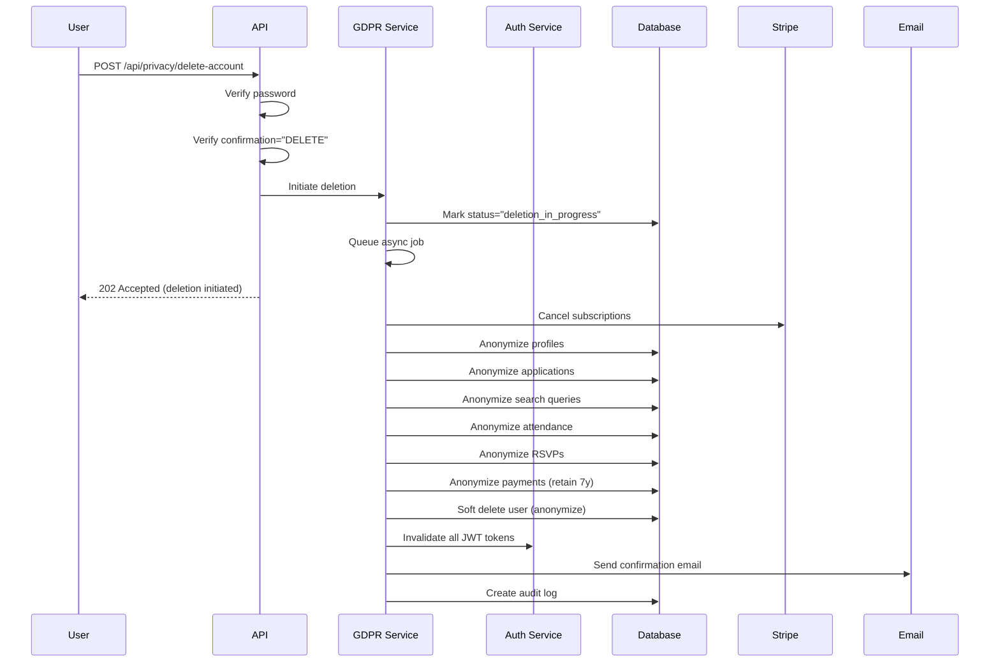

# Data Retention and Anonymization Policy

**Version:** 1.0
**Last Updated:** January 10, 2025
**Compliance:** GDPR Article 17 (Right to Erasure), CCPA, SOX, Tax Law

## Overview

This document outlines the World Wide Martial Arts Association (WWMAA) data retention and anonymization policy for user account deletion requests under GDPR Article 17 ("Right to be Forgotten"). This policy ensures compliance with privacy regulations while meeting legal and business requirements for record retention.

## Table of Contents

1. [Retention Periods](#retention-periods)
2. [Anonymization Strategy](#anonymization-strategy)
3. [Deletion Process](#deletion-process)
4. [Legal Compliance](#legal-compliance)
5. [Technical Implementation](#technical-implementation)
6. [Audit and Monitoring](#audit-and-monitoring)

---

## Retention Periods

### Immediate Deletion (Anonymized)

The following data types are **immediately anonymized** upon account deletion request:

| Data Type | Retention Period | Anonymization Method |
|-----------|------------------|----------------------|
| User Profile | Immediate | Full PII redaction |
| Personal Information | Immediate | Hash-based anonymization |
| Membership Applications | Immediate | Applicant info anonymized |
| Search Query History | Immediate | User ID anonymized |
| Training Attendance | Immediate | Participant anonymized |
| Event RSVPs | Immediate | User reference anonymized |
| Comments/Posts | Immediate | Author replaced with "Deleted User [hash]" |

**Rationale:** No legal requirement to retain; privacy rights take precedence.

### Short-Term Retention (1 Year)

| Data Type | Retention Period | Legal Basis |
|-----------|------------------|-------------|
| Audit Logs | 1 year | Security compliance, fraud detection |
| System Access Logs | 1 year | Security monitoring |

**Rationale:** Required for security incident investigation and fraud prevention. Anonymized after deletion.

### Long-Term Retention (7 Years)

| Data Type | Retention Period | Legal Basis |
|-----------|------------------|-------------|
| Payment Records | 7 years | Tax compliance (IRS), SOX |
| Invoices | 7 years | Tax law, accounting standards |
| Subscription History | 7 years | Financial record keeping |
| Transaction Records | 7 years | Anti-money laundering (AML) |

**Rationale:** Legal requirement under tax law and financial regulations. PII is anonymized while preserving financial data.

**Deletion After Retention Period:**
- All retained records are automatically hard-deleted after their retention period expires
- Automated jobs run monthly to purge expired records
- Deletion is logged for compliance auditing

---

## Anonymization Strategy

### Deterministic Hashing

We use **SHA-256 deterministic hashing** to maintain referential integrity while removing personally identifiable information (PII):

```
Original User ID: user_12345
Anonymized ID:    deleted_user_a1b2c3d4
Anonymized Name:  Deleted User a1b2c3d4
Anonymized Email: deleted-user-a1b2c3d4@anonymized.wwmaa.org
```

**Key Properties:**
- **Deterministic:** Same user ID always produces same hash
- **Referential Integrity:** Foreign key relationships preserved
- **Non-Reversible:** Cannot recover original data from hash
- **Collision-Resistant:** Different users produce different hashes

### PII Field Categories

#### Always Anonymized
- `email`, `phone`, `phone_number`
- `first_name`, `last_name`, `full_name`, `name`
- `address`, `street_address`, `city`, `state`, `postal_code`
- `date_of_birth`, `birth_date`
- `ssn`, `social_security_number`, `passport_number`
- `ip_address`, `user_agent`, `device_id`
- `location`, `coordinates`, `latitude`, `longitude`
- `bio`, `biography`, `profile_picture`, `avatar`
- `emergency_contact`, `emergency_phone`

**Replacement Value:** `[REDACTED]` or anonymized email/hash

#### Always Preserved
- `id`, `user_id` (anonymized hash, not original)
- `created_at`, `updated_at`, `timestamp`
- `status`, `type`, `tier`
- `amount`, `currency`, `payment_id`, `transaction_id`
- `event_id`, `session_id`, `subscription_id`

**Rationale:** Non-PII fields needed for audit trail and business intelligence.

### Anonymization Methods by Resource

#### 1. User Account
```python
{
  "id": "user_123",  # Preserved
  "email": "deleted-user-a1b2c3d4@anonymized.wwmaa.org",  # Anonymized
  "hashed_password": "[DELETED]",  # Removed
  "first_name": "[REDACTED]",  # Redacted
  "last_name": "[REDACTED]",  # Redacted
  "role": "member",  # Preserved for audit
  "status": "deleted",  # Updated
  "created_at": "2024-01-01T00:00:00Z",  # Preserved
  "deleted_at": "2025-01-10T12:00:00Z",  # Added
  "anonymized_at": "2025-01-10T12:00:00Z"  # Added
}
```

#### 2. Payment Records (7-Year Retention)
```python
{
  "id": "payment_123",  # Preserved
  "user_id": "deleted_user_a1b2c3d4",  # Anonymized
  "email": "deleted-user-a1b2c3d4@anonymized.wwmaa.org",  # Anonymized
  "amount": 99.99,  # Preserved (financial data)
  "currency": "USD",  # Preserved
  "transaction_id": "txn_abc123",  # Preserved
  "name": "[REDACTED]",  # Anonymized
  "billing_address": "[REDACTED]",  # Anonymized
  "created_at": "2024-01-01T00:00:00Z",  # Preserved
  "anonymized_at": "2025-01-10T12:00:00Z",  # Added
  "retention_until": "2032-01-10T12:00:00Z",  # Added (7 years)
  "retention_reason": "legal_compliance_7_years"  # Added
}
```

#### 3. Event RSVPs
```python
{
  "id": "rsvp_123",  # Preserved
  "event_id": "event_456",  # Preserved
  "user_id": "deleted_user_a1b2c3d4",  # Anonymized
  "user_name": "Deleted User a1b2c3d4",  # Anonymized
  "status": "deleted",  # Updated
  "rsvp_date": "2024-12-01T00:00:00Z",  # Preserved
  "anonymized_at": "2025-01-10T12:00:00Z"  # Added
}
```

#### 4. Comments/Posts
```python
{
  "id": "comment_123",  # Preserved
  "content": "[Original comment text]",  # Preserved
  "author_id": "deleted_user_a1b2c3d4",  # Anonymized
  "author_name": "Deleted User a1b2c3d4",  # Anonymized
  "created_at": "2024-11-15T10:30:00Z",  # Preserved
  "anonymized_at": "2025-01-10T12:00:00Z"  # Added
}
```

**Rationale:** Content is preserved for community context; author identity is anonymized.

---

## Deletion Process

### User-Initiated Deletion Flow



### Steps

1. **Request Validation** (Synchronous)
   - Verify user authentication
   - Verify password correctness
   - Verify confirmation string ("DELETE")
   - Check account not already deleted
   - Verify user deleting own account

2. **Deletion Initiation** (Synchronous)
   - Update user status to `deletion_in_progress`
   - Create initial audit log entry
   - Queue asynchronous background job
   - Return 202 Accepted to user

3. **Background Processing** (Asynchronous)
   - **Step 1:** Cancel active Stripe subscriptions
   - **Step 2:** Anonymize user profile
   - **Step 3:** Anonymize membership applications
   - **Step 4:** Anonymize search query history
   - **Step 5:** Anonymize training attendance
   - **Step 6:** Anonymize event RSVPs
   - **Step 7:** Anonymize payment records (retain 7 years)
   - **Step 8:** Soft delete and anonymize user account
   - **Step 9:** Invalidate all JWT tokens (immediate logout)
   - **Step 10:** Send confirmation email
   - **Step 11:** Create completion audit log

4. **Post-Deletion**
   - User immediately logged out (tokens blacklisted)
   - Confirmation email sent
   - Cannot undo deletion
   - Account cannot be recovered

### Deletion Guarantees

- **Synchronous Confirmation:** User receives immediate confirmation (within 2 seconds)
- **Asynchronous Completion:** Full deletion completes within 5 minutes
- **Immediate Logout:** All JWT tokens invalidated immediately
- **Email Confirmation:** Sent upon completion
- **Audit Trail:** Complete audit log maintained (anonymized, 1-year retention)

### Error Handling

If deletion fails:
- User account remains in `deletion_in_progress` state
- Audit log records failure details
- Admin notification triggered for manual review
- Retry mechanism attempts completion
- User can contact support if needed

---

## Legal Compliance

### GDPR (EU General Data Protection Regulation)

**Article 17 - Right to Erasure ("Right to be Forgotten")**

> The data subject shall have the right to obtain from the controller the erasure of personal data concerning him or her without undue delay.

**Our Compliance:**
- ✅ Erasure "without undue delay" (5 minutes)
- ✅ PII completely anonymized
- ✅ User confirmation required
- ✅ Exceptions documented (legal retention)
- ✅ Third-party data deleted (Stripe subscription)

**Exceptions Applied:**
- Article 17(3)(b): Legal obligation (tax law)
- Article 17(3)(e): Public interest archiving (anonymized audit logs)

### CCPA (California Consumer Privacy Act)

**Right to Delete:**

> Consumers have the right to request deletion of personal information collected from them.

**Our Compliance:**
- ✅ Deletion available to all users (not just CA residents)
- ✅ Confirmation email sent
- ✅ No charge for deletion
- ✅ Exceptions documented

### Financial Regulations

**IRS (United States Tax Law):**
- Financial records retained 7 years (anonymized)
- Compliant with IRS Publication 552

**SOX (Sarbanes-Oxley Act):**
- Audit logs retained 1 year
- Financial transaction integrity maintained

**PCI DSS:**
- Cardholder data not stored (Stripe handles)
- Payment metadata anonymized

---

## Technical Implementation

### Code Structure

```
backend/
├── services/
│   ├── gdpr_service.py           # Main deletion orchestration
│   ├── auth_service.py            # Token invalidation
│   └── email_service.py           # Confirmation emails
├── utils/
│   └── anonymization.py           # Anonymization utilities
├── routes/
│   └── privacy.py                 # API endpoints
└── tests/
    ├── test_gdpr_service.py       # Service tests
    ├── test_gdpr_deletion.py      # Deletion tests (38 tests)
    └── test_privacy_routes.py     # API tests
```

### Key Functions

#### `delete_user_account(user_id, password, initiated_by, reason)`
Main entry point for account deletion. Validates password, checks authorization, initiates async deletion.

**Returns:**
```json
{
  "success": true,
  "user_id": "user_123",
  "status": "deletion_in_progress",
  "message": "Account deletion has been initiated...",
  "initiated_at": "2025-01-10T12:00:00Z"
}
```

#### `anonymize_document(document, anonymization_type, user_id)`
Core anonymization logic. Recursively processes documents to redact PII while preserving non-PII fields.

**Usage:**
```python
from backend.utils.anonymization import anonymize_document, AnonymizationType

anonymized = anonymize_document(
    user_profile,
    AnonymizationType.PROFILE,
    user_id="user_123"
)
```

#### `invalidate_all_user_tokens(user_id)`
Blacklists all JWT tokens for a user. Prevents token reuse after account deletion.

**Implementation:**
- Adds user ID to Redis blacklist (30-day TTL)
- Invalidates all token families
- Token validation checks blacklist on every request

### Database Collections Affected

1. **users** - Soft deleted, fully anonymized
2. **profiles** - Anonymized immediately
3. **applications** - Anonymized immediately
4. **search_queries** - Anonymized immediately
5. **session_attendance** - Anonymized immediately
6. **rsvps** - Anonymized immediately
7. **payments** - Anonymized, retained 7 years
8. **subscriptions** - Anonymized, retained 7 years
9. **audit_logs** - Anonymized, retained 1 year

### Stripe Integration

**Actions Taken:**
1. Cancel all active subscriptions immediately
2. Update subscription status to "canceled"
3. Cancellation reason: "account_deletion"
4. No refunds issued (per ToS)

**Data Retained in Stripe:**
- Stripe retains transaction records per their retention policy
- WWMAA does not control Stripe's retention
- Users can request deletion directly from Stripe

---

## Audit and Monitoring

### Audit Log Entry

Every deletion creates comprehensive audit trail:

```json
{
  "user_id": "user_123",
  "action": "DELETE",
  "resource_type": "users",
  "resource_id": "user_123",
  "description": "Account deletion completed",
  "success": true,
  "severity": "info",
  "tags": ["gdpr", "data_deletion"],
  "metadata": {
    "deletion_results": {
      "started_at": "2025-01-10T12:00:00Z",
      "completed_at": "2025-01-10T12:04:32Z",
      "steps": [
        {
          "step": "cancel_subscription",
          "success": true,
          "details": {"subscriptions_canceled": 1}
        },
        {
          "step": "anonymize_profile",
          "success": true,
          "details": {"profiles_anonymized": 1}
        },
        // ... more steps
      ]
    },
    "initiated_by": "user_123",
    "reason": "User request",
    "gdpr_compliance": "Article 17 - Right to Erasure"
  },
  "created_at": "2025-01-10T12:04:32Z"
}
```

### Monitoring Metrics

**KPIs Tracked:**
- Deletion request volume
- Average completion time
- Success/failure rate
- Step-by-step completion rates
- Error types and frequencies

**Alerts:**
- Deletion failure (immediate)
- Completion time > 10 minutes (warning)
- Stripe cancellation failure (immediate)
- Email delivery failure (warning)

### Compliance Reports

**Monthly Report Includes:**
- Total deletion requests
- Completion success rate
- Average processing time
- Retention policy adherence
- Data purge statistics (expired records)

**Annual Audit:**
- Full compliance review
- Retention policy validation
- Anonymization effectiveness check
- Third-party processor audit (Stripe)

---

## User Communication

### Deletion Confirmation Email

**Subject:** WWMAA Account Deletion Confirmed

**Content Includes:**
- Confirmation of deletion
- List of deleted data
- List of retained data (with retention periods)
- Legal basis for retention
- Contact information for questions
- GDPR compliance statement

**Example Excerpt:**
```
This email confirms that your WWMAA account has been permanently deleted
in accordance with GDPR Article 17 (Right to Erasure).

WHAT HAS BEEN DELETED:
- All personal information and login credentials
- Profile data (anonymized)
- Membership application history (anonymized)
- Search query history (anonymized)
- Training attendance records (anonymized)
- Active subscriptions (canceled)

WHAT HAS BEEN RETAINED (ANONYMIZED):
For legal and compliance reasons, the following data has been anonymized
but retained for the specified periods:
- Payment records: Retained for 7 years (tax/legal compliance)
- Audit logs: Retained for 1 year (security requirement)

All personally identifiable information has been removed from these records.
```

### Pre-Deletion Warning (UI)

Before deletion, users see:

**"This action cannot be undone. The following will happen:"**

✅ All personal data deleted from our database
✅ Subscription canceled immediately (no refund)
✅ Past RSVPs anonymized (event organizers won't see your name)
✅ Comments/posts anonymized (appear as "Deleted User")
✅ Cannot be recovered

⏳ **Retained for legal compliance (anonymized):**
- Payment records (7 years)
- Audit logs (1 year)

**Type "DELETE" to confirm:**

---

## References

### Legal Citations

1. **GDPR Article 17** - Right to Erasure
   https://gdpr-info.eu/art-17-gdpr/

2. **GDPR Article 17(3)** - Exceptions to Right to Erasure
   https://gdpr-info.eu/art-17-gdpr/

3. **CCPA Section 1798.105** - Right to Delete
   https://leginfo.legislature.ca.gov/faces/codes_displaySection.xhtml?lawCode=CIV&sectionNum=1798.105

4. **IRS Publication 552** - Recordkeeping for Individuals
   https://www.irs.gov/publications/p552

5. **SOX Section 802** - Document Retention
   https://www.sec.gov/about/laws/soa2002.pdf

### Internal Documentation

- [GDPR Service Implementation](/backend/services/gdpr_service.py)
- [Anonymization Utilities](/backend/utils/anonymization.py)
- [Privacy API Routes](/backend/routes/privacy.py)
- [Deletion Test Suite](/backend/tests/test_gdpr_deletion.py)

### Version History

| Version | Date | Changes |
|---------|------|---------|
| 1.0 | 2025-01-10 | Initial policy (US-073 implementation) |

---

## Contact

**Privacy Officer:** privacy@wwmaa.com
**Data Protection Officer:** dpo@wwmaa.com
**Support:** support@wwmaa.com

For questions about this policy or your data privacy rights, please contact our Privacy Officer.

---

**Document Control:**
- Policy Owner: Chief Privacy Officer
- Review Cycle: Annual
- Next Review: January 2026
- Classification: Public
